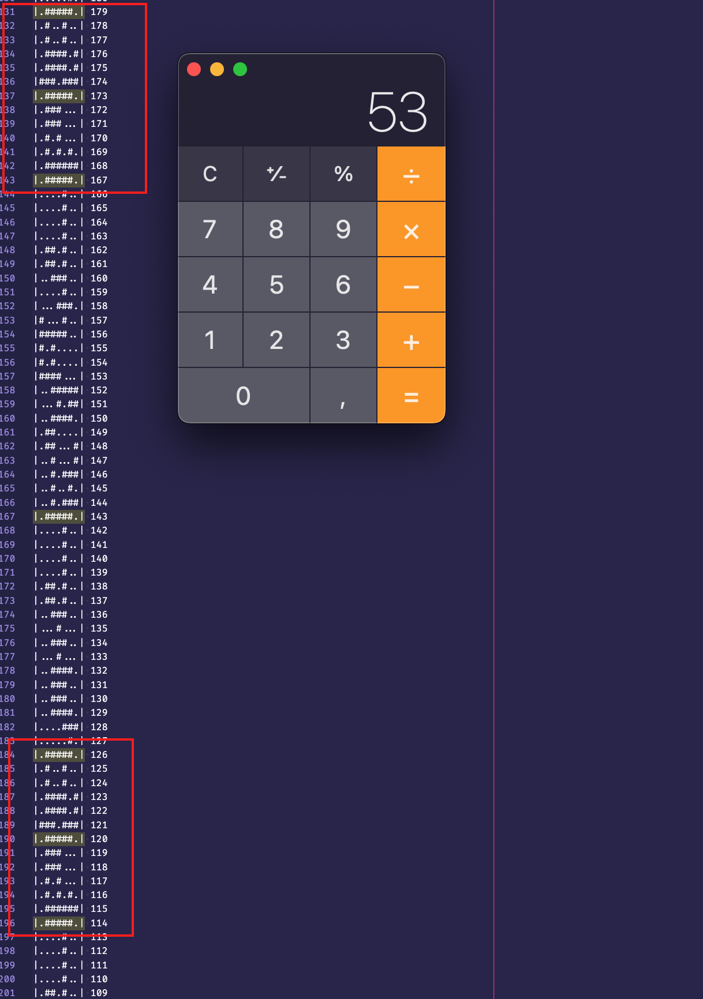
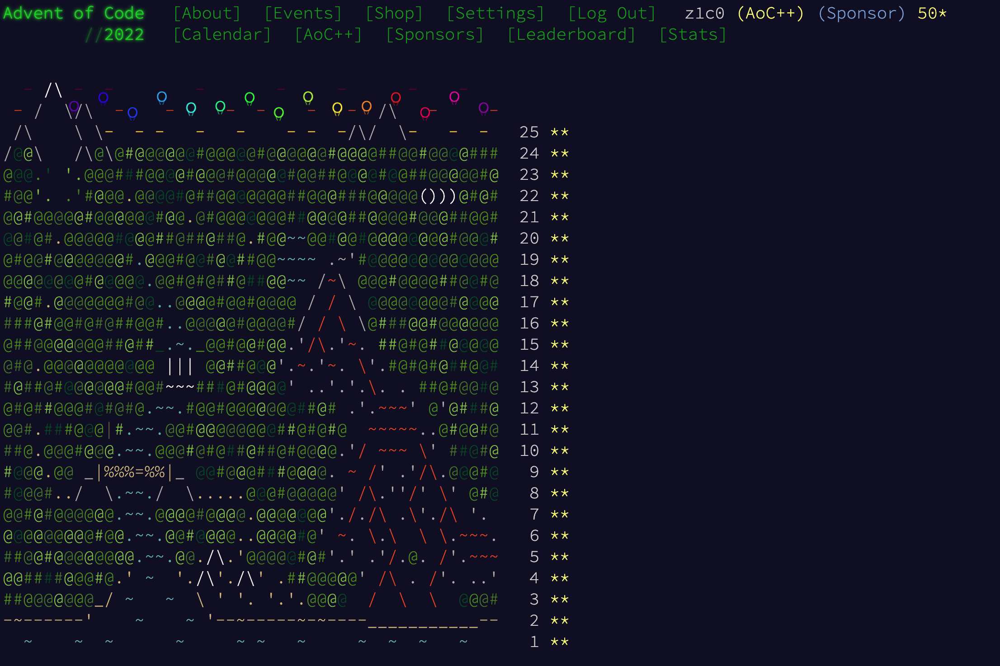

# Advent of Code 2022

<https://adventofcode.com/2022>

## Day 17

Tetris 😆



## Day 19

This was the worst and the only puzzle for which I had to go looking for hints.
These did the trick:

* Always build a Geode robot and ignore other options in that case.
* Skip states after a certain amount of time.

```text
29: 14
30: 0
Total quality level: 1466
max: 33
max: 10
max: 25
Result: 8250
END (after 161.0814019 seconds)
```

## Day 22

cube stuff ...

## Day 24

This took me a while - as so often, it was about finding the right cache key.
But then, the whole puzzle ran in a bit more than a minute.

```text
START Day24

.
.
.

Reached the goal in 934 (334 + 309 + 291) minutes.
END (after 80.9290695 seconds)
```



